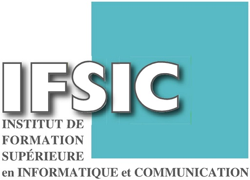

# README

On va voir dans ce document la diffèrence entre les cours du MIT OCW et ceux de l'IFSIC là où j'ai fais mes études et quelques remarques et annotations, on verra peut être si j'ajoute les polys qui existent encore dans les pages persos de leur auteurs, mes professeurs que je remercirais jamais de m'avoir apprit autant de choses qui m'ont aidé toute ma vie, j'ai bientôt 50 ans ceci date d'il y a 30 ans

Je rappelle le lien vers MIT OCW
https://ocw.mit.edu/courses/electrical-engineering-and-computer-science/

Celui de l'IFSIC https://istic.univ-rennes1.fr/

Nous verrons d'autres universités au fur et à mesure

- [Parcours et numéros de Polycopié correspondant "WiP"](PARCOURS.md)
- [Liste Complète des Polycopiés de l'IFSIC](POLYS.md)
- [Comparaison avec le MIT OCW](NOT-POLY-IFSIC.md)
- [Bibliographie](BIBLIOGRAPHY.md)
