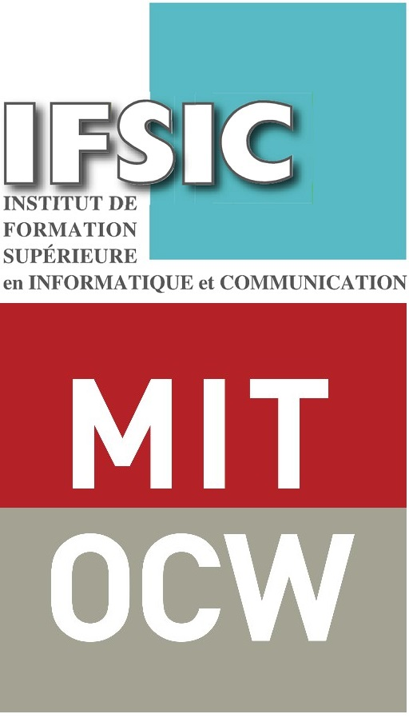

# README

Ceci n'est pas un repository des polycopié de l'IFSIC car ils sont payants, je veux juste faire une comparaison avec le MIT OCW car c'est grace à OCW si j'arrive à me repérer aujourd'hui après les changements au sein de l'IFSIC

On va voir dans ce document la diffèrence entre les cours du MIT OCW et ceux de l'IFSIC là où j'ai fais mes études et quelques remarques et annotations, on verra peut être si j'ajoute les polys qui existent encore dans les pages persos de leur auteurs, mes professeurs que je remercirais jamais de m'avoir apprit autant de choses qui m'ont aidé toute ma vie, j'ai bientôt 50 ans ceci date d'il y a 30 ans

Je rappelle le lien vers MIT OCW
https://ocw.mit.edu/courses/electrical-engineering-and-computer-science/

Celui de l'IFSIC https://istic.univ-rennes1.fr/

Nous verrons d'autres universités au fur et à mesure

## Index

- [Parcours et numéros de Polycopié correspondant "WiP"](PARCOURS.md)
- [Liste Complète des Polycopiés de l'IFSIC](POLYS.md)
- [Comparaison avec le MIT OCW](NOT-POLY-IFSIC.md)
- [Professeurs](PROFS.md)
- [Bibliographie](BIBLIOGRAPHY.md)

## Allons y et refaisons les changements

Tout ce dont je me souviens de mes études est le fait qu'ils étaient très bien organisés comme par exemple les UE de Lyon 1 et c'est ce que l'on va voir dans la suite

- [Université de Lyon 1](LYON1.md)

On voit bien qu'à la fin de la L1 on peut déjà administrer un serveur Linux, installer un serveur comme apache et coder des pages HTML/CSS/JS, en 1995 j'étais déjà capable de faire cela à la fin de ma première année de licence qui se nommait première année de DEUG, j'étais aussi capablle de monter un PC mais j'ai dû attendre la licence donc L3 aujourd'hui pour enfin m'y mettre car l'informatique personelle était à ses débuts et linux à ses premières versions, le montage PC et l'overclocking était devenu en vogue à cette période
